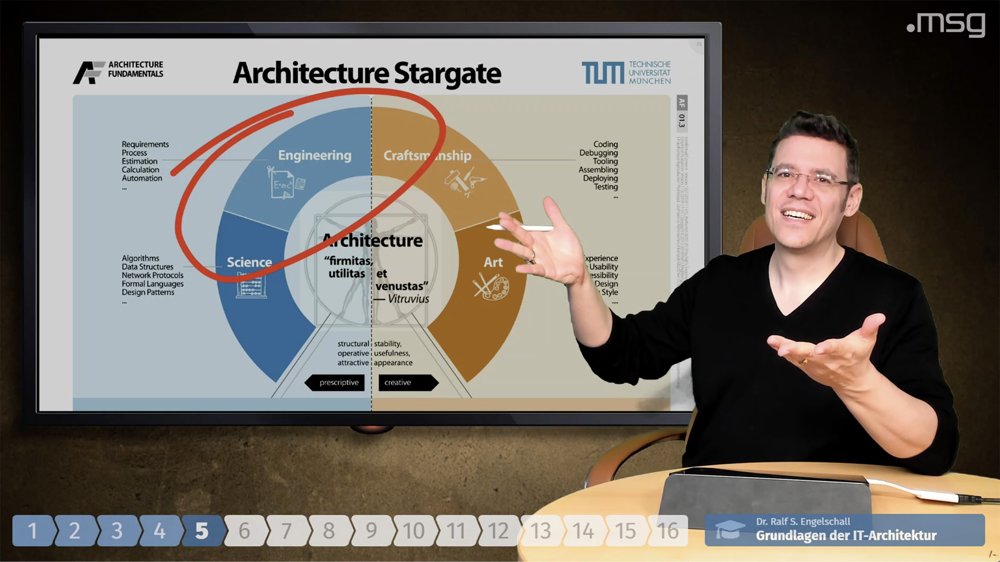

HUDS
====

**Head-Up-Display Server (HUDS)**

<p/>


<p/>


Abstract
--------

HUDS is a small server providing a
Web service for serving one or more HTML Single-Page Applications (SPA)
which act as "Head-Up-Displays (HUD)" or "Overlays" in video
production scenarios. It is specially intended to be used with [OBS Studio](https://obsproject.com/)'s
[CEF](https://en.wikipedia.org/wiki/Chromium_Embedded_Framework)-based
[Browser Source](https://obsproject.com/wiki/Sources-Guide#browsersource)
and optionally the [Elgato Stream Deck](https://www.elgato.com/en/gaming/stream-deck)
remote control device and its [System:Website](https://help.elgato.com/hc/en-us/articles/360028234471-Elgato-Stream-Deck-System-Actions) function.

HUDS serves the static files of one or more HUD HTML5 SPAs, which
render the actual HUD display in OBS. It also provides a HUDS client API to
each HUD HTML5 SPA for establishing a WebSocket connection back to HUDS.
Over this WebSocket connection HUDS pushes events to each HUD which were
received by HUDS either via WebSocket connections or REST endpoints.
The REST endpoint is intended to be used by arbitrary Web clients to
send events to any HUD. Usually, this is used with the Stream Deck
System:Website plugin or with curl(1) on the command-line.

Installation
------------

```
$ npm install -g huds
```

Usage
-----

```
$ huds -a 127.0.0.1 -p 9999 -U sample -P sample -d sample:./sample,./sample.yaml
```



License
-------

Copyright &copy; 2020 Dr. Ralf S. Engelschall (http://engelschall.com/)

Permission is hereby granted, free of charge, to any person obtaining
a copy of this software and associated documentation files (the
"Software"), to deal in the Software without restriction, including
without limitation the rights to use, copy, modify, merge, publish,
distribute, sublicense, and/or sell copies of the Software, and to
permit persons to whom the Software is furnished to do so, subject to
the following conditions:

The above copyright notice and this permission notice shall be included
in all copies or substantial portions of the Software.

THE SOFTWARE IS PROVIDED "AS IS", WITHOUT WARRANTY OF ANY KIND,
EXPRESS OR IMPLIED, INCLUDING BUT NOT LIMITED TO THE WARRANTIES OF
MERCHANTABILITY, FITNESS FOR A PARTICULAR PURPOSE AND NONINFRINGEMENT.
IN NO EVENT SHALL THE AUTHORS OR COPYRIGHT HOLDERS BE LIABLE FOR ANY
CLAIM, DAMAGES OR OTHER LIABILITY, WHETHER IN AN ACTION OF CONTRACT,
TORT OR OTHERWISE, ARISING FROM, OUT OF OR IN CONNECTION WITH THE
SOFTWARE OR THE USE OR OTHER DEALINGS IN THE SOFTWARE.

