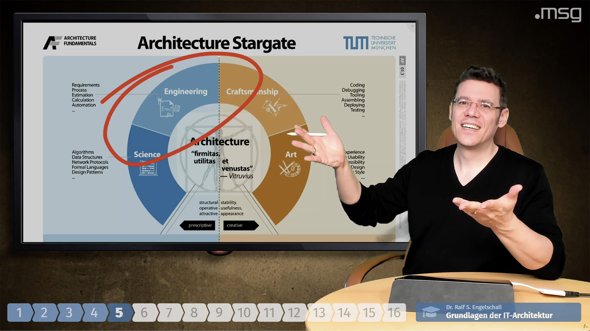
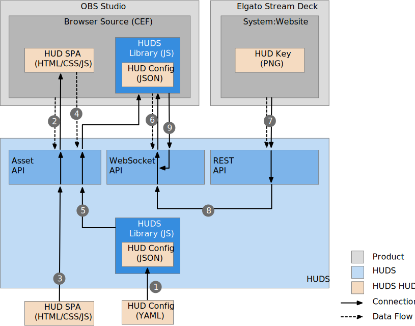

HUDS
====

**Head-Up-Display Server (HUDS)**

<p/>


<p/>


Abstract
--------

HUDS is a small server providing a
Web service for serving one or more HTML Single-Page Applications (SPA)
which act as "Head-Up-Displays (HUD)" or "Overlays" in video
production scenarios. It is specially intended to be used with [OBS Studio](https://obsproject.com/)'s
[CEF](https://en.wikipedia.org/wiki/Chromium_Embedded_Framework)-based
[Browser Source](https://obsproject.com/wiki/Sources-Guide#browsersource)
and optionally the [Elgato Stream Deck](https://www.elgato.com/en/gaming/stream-deck)
remote control device and its [System:Website](https://help.elgato.com/hc/en-us/articles/360028234471-Elgato-Stream-Deck-System-Actions) function.

HUDS serves the static files of one or more HUD HTML5 SPAs, which
render the actual HUD display in OBS. It also provides a HUDS client API to
each HUD HTML5 SPA for establishing a WebSocket connection back to HUDS.
Over this WebSocket connection HUDS pushes events to each HUD which were
received by HUDS either via WebSocket connections or REST endpoints.
The REST endpoint is intended to be used by arbitrary Web clients to
send events to any HUD. Usually, this is used with the Stream Deck
System:Website plugin or with curl(1) on the command-line.

HUDS itself is usually run ad-hoc and side-by-side to [OBS
Studio](https://obsproject.com/) (under `localhost`) but also can be
deployed to a dedicated server by optionally requiring authentication
and delivering one or more HUDs in parallel.

Installation
------------

Install Node.js and then install HUDS globally into your system with:

```
$ npm install -g huds
```

Usage
-----

The Unix manual pages
[huds(8)](https://github.com/rse/huds/blob/master/src/huds-server.md)
(for the server CLI) and
[huds(3)](https://github.com/rse/huds/blob/master/src/huds-client.md)
(for the client API) provide detailed usage information.

Example
-------

Run a minimalistic [Hello World HUD](https://github.com/rse/huds-hud-hello/) with:

```
$ npm install -g huds huds-hud-hello
$ huds -a 127.0.0.1 -p 9999 -U hello -P hello -d hello:@huds-hud-hello
```

For a more elaborated HUD check out the [Training
HUD](https://github.com/rse/huds-hud-training/). It supports performing
trainings as webinars and looks like this in practice:



Architecture
------------

HUDS is based on a Client/Server architecture as illustrated in the
following diagram:



The individual communication steps in the diagram are:

1.  [HUDS](src/huds-server.js) reads the HUD configuration and converts its content from
    YAML to JSON format for embedding into the HUDS (Client) Library.
    See [training.yaml](https://github.com/rse/huds-hud-training/blob/master/training.yaml)
    for an example of a HUD configuration.

2.  OBS Studio's CEF-based Browser Source open the URL
    `http://127.0.0.1:9999/<hud-id>/`

3.  [HUDS](src/huds-server.js) delivers the HUD SPA with all its HTML/CSS/JS files.
    The individual assets are served via
    the HUDS URLs `http://127.0.0.1:9999/<hud-id>/<asset>`.
    See [Hello World HUD](https://github.com/rse/huds-hud-hello/)
    for an example of a simple HUD and
    [Training HUD](https://github.com/rse/huds-hud-training/)
    for an example of a more elaborated HUD.

4.  The HUD SPA (in its `index.html`) references the [HUDS (Client) Library](src/huds-client.js) with:
    `<script type="text/javascript" src="huds"></script>`.

5.  [HUDS](src/huds-server.js) delivers the [HUDS (Client) Library](src/huds-client.js) (and its embedded HUD configuration)
    under virtual HUDS URL `http://127.0.0.1:9999/<hud-id>/huds`.

6.  The [HUDS (Client) Library](src/huds-client.js) opens a WebSocket connection back to [HUDS](src/huds-server.js)
    under the HUDS URL `http://127.0.0.1:9999/<hud-id>/event`.

7.  An external program (like Elgato Stream Deck's System:Website
    function or Node-RED's HTTP-Request or just cURL) triggers an event
    under the HUDS URL `http://127.0.0.1:9999/<hud-id>/event/<event-name>=<event-value>`.

8.  [HUDS](src/huds-server.js) forwards the received event to all instances of the HUD by
    sending out the event to all HUD SPAs over their WebSocket
    connections. Notice: a single HUD can be opened multiple times and
    then all opened instances receive the event. This is useful to run a
    HUD both in OBS Studio and in parallel in the browser on a control
    notebook in case no dedicated Elgato Streak Deck remote control device is used.

9.  Similary, even HUD SPAs are allowed to send events (to theirself or other
    HUDs) over their WebSocket connection. This is useful to have a central
    dashboard HUD which controls one or more actual video HUDs.

License
-------

Copyright &copy; 2020 Dr. Ralf S. Engelschall (http://engelschall.com/)

Permission is hereby granted, free of charge, to any person obtaining
a copy of this software and associated documentation files (the
"Software"), to deal in the Software without restriction, including
without limitation the rights to use, copy, modify, merge, publish,
distribute, sublicense, and/or sell copies of the Software, and to
permit persons to whom the Software is furnished to do so, subject to
the following conditions:

The above copyright notice and this permission notice shall be included
in all copies or substantial portions of the Software.

THE SOFTWARE IS PROVIDED "AS IS", WITHOUT WARRANTY OF ANY KIND,
EXPRESS OR IMPLIED, INCLUDING BUT NOT LIMITED TO THE WARRANTIES OF
MERCHANTABILITY, FITNESS FOR A PARTICULAR PURPOSE AND NONINFRINGEMENT.
IN NO EVENT SHALL THE AUTHORS OR COPYRIGHT HOLDERS BE LIABLE FOR ANY
CLAIM, DAMAGES OR OTHER LIABILITY, WHETHER IN AN ACTION OF CONTRACT,
TORT OR OTHERWISE, ARISING FROM, OUT OF OR IN CONNECTION WITH THE
SOFTWARE OR THE USE OR OTHER DEALINGS IN THE SOFTWARE.

